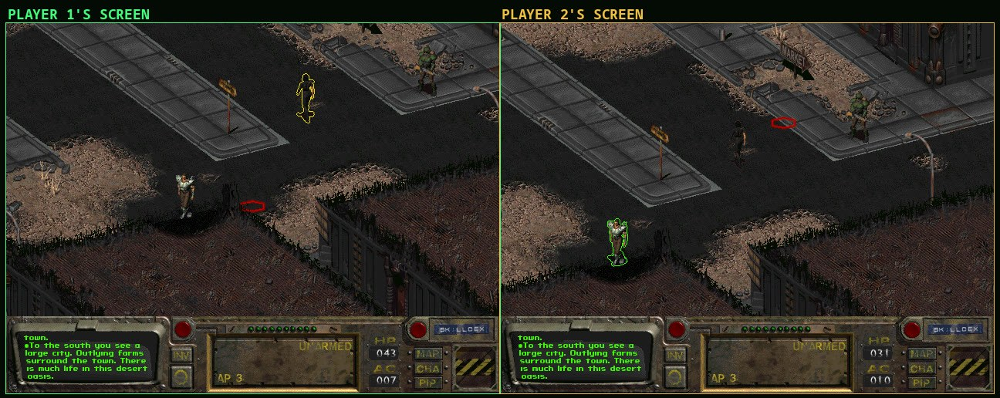
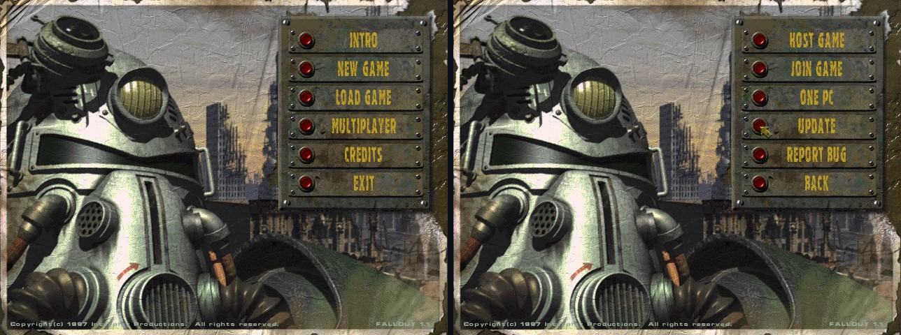

# Fallout Co-op

Play Fallout with a friend. This is a fan-made two-player co-op mod for
Fallout 1, built on [Fallout Community Edition](https://github.com/alexbatalov/fallout1-ce).
Player 1 hosts the game; player 2 joins over a LAN, the internet, or on
the same PC, with their own character.

**Built with AI.** The code, tests and docs were written by an AI coding
assistant (Claude, by Anthropic). A person decided what to build, played
it and set the priorities. [How it was made](docs/coop/HOW-IT-WAS-MADE.md)
explains the process.

You need your own copy of Fallout (GOG or Steam). No game files are
included. Co-op is off by default: without it the game plays exactly like
Fallout CE.

Co-op lives in Fallout's own main menu: **MULTIPLAYER** opens hosting,
joining, one-PC play, updates and bug reports.

## Install

Download the package for your system under
[Releases](https://github.com/FadingTwo/fallout1-coop/releases), or build
it yourself (see the end of this page).

- **Windows:** unzip and copy `fallout-ce.exe` into your Fallout folder.
- **Linux:** needs SDL2 (`sudo apt install libsdl2-2.0-0`). Copy
  `fallout-ce` into your Fallout folder and run it.

The first start shows a setup screen that finds your Fallout files. Then
pick **MULTIPLAYER** in the main menu. Without a co-op server (see
[docs/coop/SERVER.md](docs/coop/SERVER.md)) you play on a LAN, on one PC,
or online by entering the host's address.

For more about the engine itself (other platforms, `fallout.cfg`,
`f1_res.ini`), see [Fallout CE's README](https://github.com/alexbatalov/fallout1-ce#readme).

## More

- [COOP.md](COOP.md): how to play, the rules, and the settings
- [docs/coop/ARCHITECTURE.md](docs/coop/ARCHITECTURE.md): how it works
- [docs/coop/SERVER.md](docs/coop/SERVER.md): running your own server
  (server list, relay for online play, updates, bug reports); the game
  works without one on a LAN or with a direct address
- [docs/coop/TESTING.md](docs/coop/TESTING.md): the automatic tests
- [docs/coop/HOW-IT-WAS-MADE.md](docs/coop/HOW-IT-WAS-MADE.md): how it
  was built, and why it works the way it does
- [CONTRIBUTING.md](CONTRIBUTING.md)
- [Ideas](https://github.com/FadingTwo/fallout1-coop/issues?q=is%3Aissue+is%3Aopen+label%3Aenhancement):
  what could come next; comment or add a 👍 to the ones you want

Build with `cmake -B build && cmake --build build` (needs SDL2), or build
the Linux and Windows packages with `tools/build-release.sh`.

Unofficial. Not affiliated with or endorsed by Bethesda Softworks,
ZeniMax, Microsoft or Interplay. Licensed like Fallout CE under the
Sustainable Use License (free, non-commercial).
